================
Website tutorial
================

.. warning:: 
    This page is under construction. Contact Trestan Pillonel (trestan.pillonel@chuv.ch) if you have any question or suggestion regarding the website or its documentation.

This page attempts to provide the user with help to understand and perform the analyses offered in the webinterface.
| In this tutorial a database composed of a collection of *Enterobacteriaceae* genomes is presented and a focus on the fliLMNOPQR operon and specifically on FliL is reserved to display the available analyses. This operon is FlhDC-dependent and encodes important regulatory factors and structural components of the membrane-spanning basal body of the flagellum.

--------------------------------
HOME page
--------------------------------
In the HOME page the user has an overview of the genomes included in the database through the 'Genome' and 'Phylogeneny' sections (see the paragraph below) and the status of the database. Indeed, a summary reports which analyses are available, and which have not been included in the generation of the database.
Note that it is necessary to re-run the pipeline to incude the new analyses if wished (-resume argument - see documentation)
| Direct access to the available analyses is provided in:
    * the home page
    * the left menu to facilitate the navigation

--------------------------------
Genome table and phylogeny
--------------------------------
Through the genome table the user can move the first steps to globally evaluate the content of the database, getting details about the contigs and the loci identified on each genome (the clickable locus tags redirect to the 'Protein annotation view' page).
The phylogeny, built on concatenated single copy orthologs with FastTree, shows the evolutionary relationships between the genomes given in input and essential data for the quality assessment of the given sequences.

--------------------------------
Homology search - Blast
--------------------------------
Perform a blast search of one or more sequences of interest against one or more genomes of the database.
| Either an amino-acid or a nucleotide sequence can be given as input.

Set up:
    * the type of homology search according to the input file:
         - blastp, tblastn with an aa sequence
         - blast_ffn, blast_fna, blastx with a nt sequence
    * e-value
    * maximum number of hits to display
    * target genome or all genomes

Note: If the search is performed against all genomes, max number of hits should be set up to 'all' to avoid losing high identity matching hits. 

In the reported example the protein sequence of the genes of fliLMNOPQR operon extracted from *Enterobacter soli* genome are blasted (blastp) against all genomes of the database (**Fig.1**).

Through this analysis it is possible to identify whether any of these genes is present in the genomes and evaluate the number and the identity of the alignment of each hit (**Fig.2 - Result 1**):

| A. visual identification of hits for fliL gene

| B. info table about the hits (genome, contig/locus_tag, alignment scores and identity - Note that the locus tags are clickable and linked to the 'Protein annotation view'),

| C. Alignment of the query and the sequence of a hit selected in table B.

| Additionally, the generated annotated phylogeny facilitate the interpretation of their distribution and conservation along all the genomes. As shown in **Fig.2 - Result 2**, 
four genomes carry all the investigated genes, fourteen genomes do not carry them, while the remaining ones have an incomplete set. 

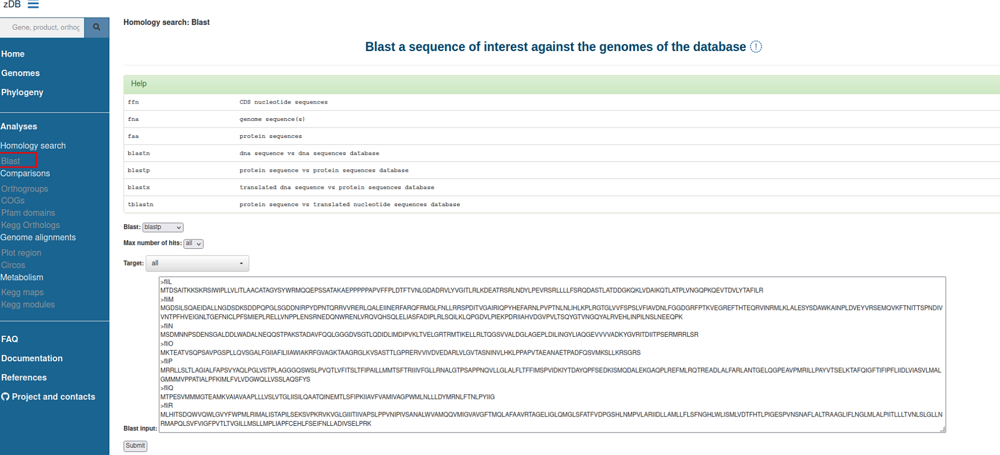

    **Figure 1:** Blast interface for homology search. Blastp of fliLMNOPQR operon genes (target: all, max number of hits: all). In 'blast input' box amminoacid sequences of all genes introduced by a header.

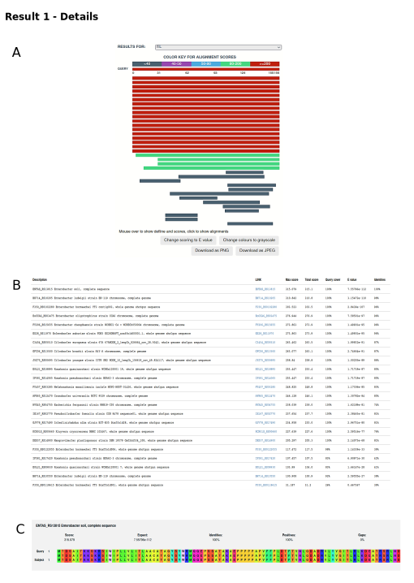

.. figure:: ../img/blastp_result2.svg
    :figclass: align-center
    :width: 100%

    **Figure 2:** Blastp results. **Result 1**: Details and **Result 2**: Phylogenetic distribution. 

**TIPS**:

- If you are interest in a specific gene expected to be present in one of the genomes included in the database, you can either retrive the sequence in a public database, such as SwissProt, or use the search bar in the menu on the left side of the web interface to identify which loci have been annotated with that gene and directly retrieve both the nucleotide and amino acid sequence of the gene through the 'Protein annotation view' page.
- Compare the genomic regions around a protein of interest in selected genomes accessing 'MENU/Genome alignments/Plot region' analysis. Below the ouput generated focusing on the fliL gene of the FliLMNOPQR operon.

--------------------------------
Comparisons
--------------------------------
This block of analyses let the user compare several aspects of selected genomes that can widely change based on the settings defined by the user during the generation of the database (See the documentation for an extensive explanation)
Orthogroups are identified by default and the annotations are automatically retrieved by the .gbk files given as input, while further annotations can be assigned with Swissprot and Refseq databases only upon request (Note that RefSeq annotations are highly computational- and time-demanding)
Differently, the user can optionally identify KEGG, COG, and PFAM domains along the genomes during the database generation and perform comparative analyses for each annotation.

Before proceeding here a brief summary of the mentioned annotations and the link to their databases:
- Kegg: Kegg annotations refer to the 'Kyoto Encyclopedia of Genes and Genomes (KEGG)'_. The genome annotation is composed of two aspects: a) KO assignemnt (KO is the identifier given to a functional ortholog defined from experimentally characterized genes and protein in specific organism), b) KEGG mapping where each KO is stored in a PATHWAY or MODULE identified based on molecular networks. This database provides a highly curated and repliable description of the metabolic pathway of the annotated genomes.
- COG: COG annotations refer to the database of 'Cluster of Orthologous Genes (COGs)'_. In this database each COG is assigned to a functional category including metabolic, signal transduction,repair and other pathways. This database allows an easy comparison of organisms based on their preference for certain pathways.
- Pfam: Pfam annotations refer to the Pfam database used to identify protein families and domains. Due to the nature of proteins as combinations of fixed structure, this database is based on the idea that the identification of domains wihin proteins can provide insights to discover their function.

| The following example in **Fig. 3** refers to the Orthogroups analyses, however the same outputs are generated also when KEGG, COG and PFAM domain are considered (check the help paragraph entitled 'Additional plots for Kegg Orthologs and Cluster of Orthologous Groups (COGs)' to discover the extra outputs generated with some of these annotations).

**Overview of Orthogroups analyses**

Orthogroups are identified with 'Orthofinder'_, an accurate platform that cluster <<set of genes that are descended from a single gene in the last common ancestor of all the species being considered >> as reported in its 'publication'_.
| In the reported example the following genomes are considered: *Enterobacter soli, Enterobacter ausbriae, Enterobacter ludvigii, and Klebsiella variicola*.

List of analyses:

| **1. Detailed comparison**: identify those orthogroups uniformly present in a set of genomes of interest and, optionally absent in others. Flexibility can be given to include orthogroups that, although present in some of the selected genomes, are not uniformly present in all and are missing in some ('Missing data' parameter).

| **1A.** Summary of the selected settings for the comparative analysis.
| **1B.** List of identified orthogroups, description and distribution in the selected genomes.
| **1C.** List of locus tags per each orthogroup and genome.

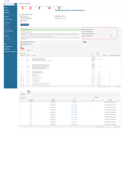

    **Figure 3:** Orthogroups comparison overview of *Enterobacter soli, Enterobacter ausbriae, Enterobacter ludvigii, and Klebsiella variicola*

 | **2. Venn diagram**: select a maximum of 6 genomes to visualize the distribution of their Orthogroups. This representation simplifies the identification of similarity/dissimilarity of Orthogroups between a few genomes.
 | **3. Compare Orthogroup size**: Visualize the number of entries of each Orthogroup in common between a selected set of genomes. This representation higlights which orthogroups are enriched or poorly represented in the genomes of interest.
 | **4. Whole proteome heatmaps**: Heatmap of presence/absence of the pool of Orthogroups present in the selected genomes. Discover which Orthogroups are widely shared by a subset of interest and which genome differentiate from the others. Going over the plot with the mouse it displays the orthogroup name, the organism of interest and the nummber of hits associated to that Orthogroup.

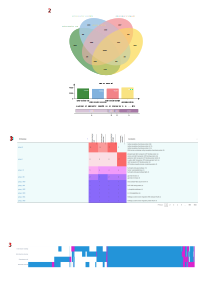

    **Figure 4.** Orhogroup comparison analyses of  *Enterobacter soli, Enterobacter ausbriae, Enterobacter ludvigii, and Klebsiella variicola*.

| **5.Pan/Core genome plot**: Graphical representation of the pan- and core- genome of a subset of genomes or of the uploaded dataset.
This analysis generates three plots that display the content and conservation of Orthologous groups in selected genomes of interest.

|**A**: this plot shows the number of all Orthologous groups present in a set of genomes. If the green curve reaches a plateau we can talk about 'closed pangenome' since no new Orthogroups are carried by additional genomes, on the contrary if the increment of the curve grows when looking at other genomes we can talk about 'open pangenome'.
|**B**: The red curve represents the core Orthogroups shared by the genomes and it tends to decrease as much as the compared genomes are different.
|**C**: the blue curve represents the number of Orthologous groups present in exactly n genomes displayed in the x-axis. This representation is useful to appreciate how many Orthologous groups are present in the totality of the genomes of interest, for example, or the diversity brought by single genomes. For example, if tot-1 is low it means that there are no specific genomes that bring a unique Orthologous groups.

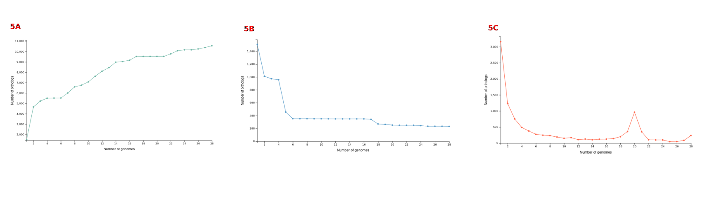

    **Figure 5.** Accumulation/rarefaction plots.

Additional plots for Kegg Orthologs and Cluster of Orthologous Groups (COGs)
=============

As anticipated, the comparative analyses of Kegg and COGs come with additional plots.

1.  Barchart of the distribution of the entries annotated with a COG/KEGG category of selected genomes. Evaluation of potential increment or descrement of entries known to be relevant for a certain function in genomes of interest.

.. figure:: ../img/COGs_overview_bar_o.svg
    :figclass: align-center

    **Figure 6.** COGs comparison page. Barchart for each COG category representing the number of entries identified in each genome. The 'Cell motility' category is highligthed in green to strees the differences between the four selected genomes: *Klebsiella variicola* shows a lower number of entries compared to the other *Enterobacter* genomes.

2 and 3. Heatmaps of the COGs along all the genomes expressed as fequency or number of identified entries. (This is available only for COGs)

.. figure:: ../img/COGs_heatmaps_o.svg
    :figclass: align-center

    **Figure 7.** Heatmaps of presence/absence of entries annotated with each COG category expressed as counts (2) or as frequencies (3). In green boxes the 'Cell motility' category, in blue two genomes of interest.

--------------------------------
Genome alignments
--------------------------------
Align the genomes and check the conservation of specific regions of interest. Again, a focus on the fliLMNOPQR operon in *Enterobacter soli, Enterobacter ausbriae, Enterobacter ludvigii, and Klebsiella variicola* is reserved.
The operon is conserved among all genomes except in *Klebsiella variicola*, as already noticed in the phylogeny obtained with the blastp search. Due to its lack it is not reported in the 'Plot region' analysis, however a high identity conservation is mantained for this operon among the other three genomes.

Plot region
=============
Plot the genomic features located in the neighborhood of a provided target locus. This plot displays the conservation of the protein of interest and the flanking region among selected genomes (max 20000 bp).
The conservation of a single protein, or of an operon, for example, as reported here, can be evaluated and compared. 

Circos
=============
Visualize genomes alignment in a circular layout. Following the help box it is possible to recognize which regions encode for genes or tRNA, additionally, the identity percentages helped the identification of conconserved genes.
This visualization favorites the identification of regions which are conserved or absent compared to the reference genome. It is possible to appreciate if any region is conserved or missed among a group of genomes of interest, for example, and looking at the GC content speculate that it is the product of an HGT event. However, please note that regions present in one of the compared genomes but in the reference, will not be visualized. A new plot inverting the genome given as reference will give this info.
When the user clicks on a gene of interest the protein annotation view page will be displayed and provide the user with all the information about function, distribution and conservation of this protein. 

.. figure:: ../img/Plot_region_ENTAS_RS13815_fliL_Soli_and_circos_o.svg
    :figclass: align-center
    :width: 130%

    **Figure 8.** A. Circos plot of four genomes of interest and B. focus on the genomics region (20000 bp) around fliL gene (fliLMNOPQR operon). The operon is conserved among Enterobacter soli, Enterobacter asburiae and Enterobacter ludwigii. In red the gene encoded in the locus tag provided, in green CDs, in black the pseudogenes, and in yellow rRNAs and tRNAs.

--------------------------------
Metabolism
--------------------------------
This section provides the user with a set of analyses useful to discover the metabolism of the given genomes based on the KEGG Orthology database.
The focus is on the functional orthologs of the KO database which are identified and included in molecular interaction, reaction and relation networks, named KEGG pathays maps, and functional units of gene sets, named Kegg modules associated to metabolism.
The two proposed analyses let the user discover the composition of Kegg maps and modules of a metabolic category of interest of a single genome or a set of them.

Kegg maps
=============
With this analysis it is possible to discover the Kegg pathways of a genome of interest, which Kegg orthologs of the pathway are present and compare their distribution in the other genomes.
In the following example, the Kegg pathways present in the *Enterobacter Soli* genome are listed and a heatpat of the Ko of the flagellar pathways is shown. In this page a direct link to the official Kegg page is provided and in red are reported the Ko present in the genome of interest.
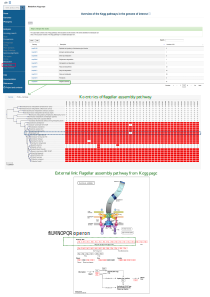

    **Figure 9.** Metabolism/kegg maps analysis. Steps to identify the completeness of a Kegg pathway for a genome of interest. The flagellar assembly pathways of *Enterobacter soli* is shown.

Kegg modules
=============
With this analysis it is possible to discover the KO of Kegg modules, organized in categories and sub categories, of a genome of interest or a subset of them.
Three types of search are available:
Category heatmap: discover a Kegg category of interest, such as Energy metabolism and get an overview of the presence/absence of the kegg modules part of this category in the whole set of genomes. In **Fig. 10 A**, the KO entry M00175 that refers to 'Nitrogen fixation, nitrogen --> ammonia is present only in a few genomes, and one of them is *Klebsiella variicola*.
Sub category heatmap: similar output than the 'Category heatmap' search, but considering subcategories - for example ATP synthesis.
Compare strains: this search let the user focus on a selected set of genomes to compare all the Kegg modules carried by them and better appreciated their distribution within the genomes. In **Fig. 10 B**, the four genomes are compared.

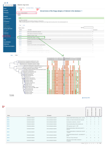

    **Figure 10.** Metabolism/kegg module analysis. A 'Category heatmap' output, B: 'Compare strains' output.

Search 1 and 3 come with a link to the Kegg module overview page (see below).
   
Kegg module overview page
=============
This page, accessible clicking on the Kegg module entry from the 'Metabolism/Kegg module' analysis or from the 'Locus tag overview page', gives access to the list of Ko entries that form the Kegg module of interest and provides an indication of the completeness of the Kegg module within the genomes of the database.

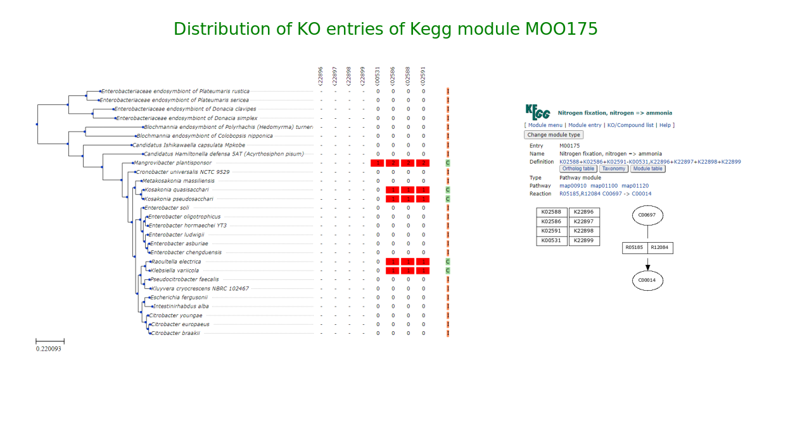

    **Figure 11.** Phylogeny annotatedd with presence/absence of KO entries of kegg module M00175.

--------------------------------
Search for a protein of interest
--------------------------------

The following protein accessions are recognised and can be used in the search bar and also as input to the plot region analysis (CHECK WHICH ONES ARE STILL OK):

=============================   =================
Name 	                        Example
=============================   =================
Genbank locus tag 	            wcw_1594_
Genbank protein accession 	    ADI38940.1_
RefSeq locus tag 	            WCW_RS07680_
RefSeq protein accession 	    WP_013182646.1_
UniParc accession 	            UPI0001D5C1DD_
UniProtKB-Accession 	        D6YS95_
UniProtKB-ID 	                D6YS95_WADCW_
=============================   =================

\

\

It's also possible to search for a gene or product name:

    * mreb_
    * `mreb Waddlia`_
    * `secretion system`_

\

Please note that the search is performed in coding sequence annotations but also in ``Kegg Orthologs``, ``Interpro`` and ``Kegg 
Pathways/Modules`` description fields. The results (if matches were found) are reported in separate tabs (Figure 1).

\

.. figure:: ../img/search.png
    :figclass: align-center
    :width: 90%

    **Figure 1:** Search result for ``secretion system``. Note the presence of multiple tabs with search results in 
    coding sequence annotations ("**locus** tab"), but also in **EC**, **Kegg Orthologs** (KO), 
    **Interpro** and **Kegg Pathways**/**Modules** descriptions.

It's also possible to browse genomes tables from links listed in the `zDB home page`_ (column: Browse online)

------------------------
Protein annotation view
------------------------
This page provides a complete overview of a selected locus of interest.
In the example reported, the page displays the locus tag ENTAS_RS13815 of *Enterobacter soli* annotated with the fliL gene. The following info can be retrieved from the 'Overview' page:
1: A summary of the locus tag name, its size, the gene name if annotated and gene product are reported.
2: The Orthologous group in which the locus tag has been reported, the number of homologs, the number of genomes there have been found, and the Orthologous group in which all the homologs have been assigned are displayed.
3: the genomic region around the locus tag of interest. This plot provides an interactive way to discover of the flancking region of the target.
4: Box with useful functional and metabolic annotations (adatpted to the requested annotations in the config file) 

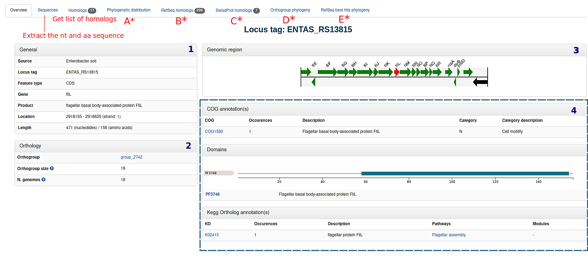

    Figure 11: Locus tag page overview. Overview of the locus tag ENTAS_RS13815 of *Enterobacter soli* encoding fliL gene.

In the further sections it is possible to observe the phylogenetic distribution of the locus tag orthogroup and the phylogeny of the homologs with a dedicated attention to the Pfam domains composing them. Additionally, SwissProt and RefSeq annotations are listed to further evaluate the best homologs according to their databases and the best RefSeq hits are included in the homologs phylogeny. These analyses result to be useful to better characterize the locus, whether the other annotations are not consistent for example, or to infer horizontal gene transfer occurences, and additionally, to observe potential dissimilarities/similarities in terms of Pfam domains between members of the same orthogroup. 

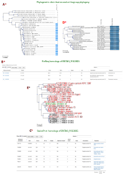

    Figure 12: Locus tag page overview. A: phylogenetic distribution of the orthogroup; B: Homologs of ENTAS_RS13815 locus tag identified in RefSeq; C: Homologs of ENTAS_RS13815 locus tag identified in SwissProt; D: Orthogroup phylogeny of group_2742 with Pfam domains annotation; E: Phylogeny of the orthogroup identified in the set of genomes plus the addition of the three best RefSeq hits of locus tag ENTAS_RS13815.

In the boxes with annotation of kegg cogs and pfam you will be redirected to the page of one of these annotations (3 ouputs, all similar, with link to external sources, occurences in proteins in the orthologous groups, then list of locus tags with that annot in all the genomes of the database, phylogeny of the dataset annotated with the copis of hits for that annotation and their distribution in the orthologous groups --- MAYBE PUT AN EXAMPLE OF THAT PAGE FOR ONE ANNOTATION  )

-----------------------------
Orthogroup annotation summary
-----------------------------

This page represents several overlaps with the locus tag page, however this is focused on the orthogroup whether on a single member and its homologs. Indeed, it may occur that the homologs of a locus tag are split within more orthogroups.   
Of interest, in this page the alignment between the members of the orthogroup is available and amino acid substitutions can be easily observed (Fig.13 A)

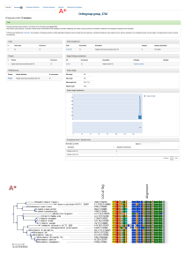

Figure 13: Overview of orthogroup 2742 of fliL gene of *Enterobacter soli* and protein alignment of its members.

-----------------------------
COG/Pfam annotation summary
-----------------------------
Overview of COG and Orthogroups annotations --> how many proteins have that COG annotations and in how many and which Orthogroups they are present. List with each locus tag with that COG annotation and phylogeny annotated with heatmap of the entries with that COG and the distribution into Orthogroups (potential errors)

-----------------------------
Pfam annotation summary
-----------------------------
Exactly the same of COG but with pfam domains

---------------------------------------------------
Search using COG, Pfam, Interpro or KEGG accessions
---------------------------------------------------

Accessions from ``KEGG``, ``COG``, and ``Pfam`` can also be searched. 
The result page will report a summary of the entry,  the list of proteins annotated 
with this entry as well as a figure showing the presence/absence of this annotation 
in all genomes included in the database (Figure 2).
\

==================  ==========  =========================================================
Accession type 	    Example 	Description
==================  ==========  =========================================================
KEGG ortholog 	    K00844_ 	hexokinase [EC:2.7.1.1]
COG 	            COG0333_ 	Ribosomal protein L32
PFAM 	            PF06723_ 	MreB/Mbl protein
InterPro            IPR004753_  Cell shape determining protein MreB
KEGG modules 	    M00023_ 	Amino acid metabolism
Kegg pathways 	    map00400_ 	Phenylalanine, tyrosine and tryptophan biosynthesis
==================  ==========  =========================================================

\

\

.. figure:: ../img/K01902_profile.svg
    :figclass: align-center
    :width: 60%

    **Figure 2:** See the `complete profile online`_. 

\

\

.. figure:: ../img/TCA_MAP.svg
    :figclass: align-center
    :width: 90%

---------------------------------------------------------------
Alignments of target genomic regions (from two or more genomes)
---------------------------------------------------------------

.. figure:: ../img/region_align.svg
    :figclass: align-center

    Figure 1: Simplified annotation workflow.

----------------------------------------------------
Whole genomes alignments: interactive circular plots
----------------------------------------------------

.. figure:: ../img/circos_interactive.png
    :figclass: align-center

    Figure 1: Simplified annotation workflow.

--------------------------------------------
comparing the content of two or more genomes
--------------------------------------------

+++++++++
Overview
+++++++++

.. figure:: ../img/extract_orthogroup_page.png
    :figclass: align-center

    Figure 1: Simplified annotation workflow.

+++++++++++++++++++++++++++++++++++++++
Venn diagrams to compare genome content
+++++++++++++++++++++++++++++++++++++++

+++++++++++++++++++++++++++++++++++++++++++++++++++++++++++++++++++++++++
Identification of the largest protein families in one or multiple genomes
+++++++++++++++++++++++++++++++++++++++++++++++++++++++++++++++++++++++++

----------
Metabolism
----------
Kegg mapsSelect the genome of interest (Soli),
1)see number if Kegg Orthologs identified for each kegg map
2) click on one map 
3)Two ouputs: for each kegg orth its frequency in this genome and in all the genome sof the dataset --> see if it is abundant or unique or rare etc in your genome of interest
            - second output the phylogenetic tree annotated with all the kegg orthogroups and their frequencies in all genomes (not only one now)

.. _`zDB home page`: https://chlamdb.ch/#genomes
.. _mreb: https://chlamdb.ch/locusx?accession=mreb
.. _`mreb Waddlia`: https://chlamdb.ch/locusx?accession=mreb+Waddlia
.. _`secretion system`: https://chlamdb.ch/locusx?accession=secretion+system
.. _wcw_1594 : https://chlamdb.ch/locusx?accession=wcw_1594
.. _ADI38940.1 : https://chlamdb.ch/locusx?accession=ADI38940.1
.. _WCW_RS07680 : https://chlamdb.ch/locusx?accession=WCW_RS07680
.. _WP_013182646.1 : https://chlamdb.ch/locusx?accession=WP_013182646.1
.. _UPI0001D5C1DD : https://chlamdb.ch/locusx?accession=UPI0001D5C1DD
.. _D6YS95 : https://chlamdb.ch/locusx?accession=D6YS95
.. _D6YS95_WADCW : https://chlamdb.ch/locusx?accession=D6YS95_WADCW
.. _K00844 : https://chlamdb.ch/locusx?accession=K00844
.. _COG0333 : https://chlamdb.ch/locusx?accession=COG0333
.. _PF06723 : https://chlamdb.ch/locusx?accession=PF06723
.. _IPR004753 : https://chlamdb.ch/locusx?accession=IPR004753
.. _M00023 : https://chlamdb.ch/locusx?accession=M00023
.. _map00400 : https://chlamdb.ch/locusx?accession=map00400
.. _`complete profile online` : https://chlamdb.ch/locusx?accession=K01902#tab3
.. _`publication` : https://genomebiology.biomedcentral.com/articles/10.1186/s13059-015-0721-2
.. _`Orthofinder` : https://github.com/davidemms/OrthoFinder
.. _`Kyoto Encyclopedia of Genes and Genomes (KEGG)` : https://www.genome.jp/kegg/ko.html
.. _`Cluster of Orthologous Genes (COGs)` : https://www.ncbi.nlm.nih.gov/research/cog
.. _`Pfam` : http://pfam.xfam.org/