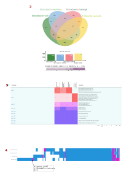
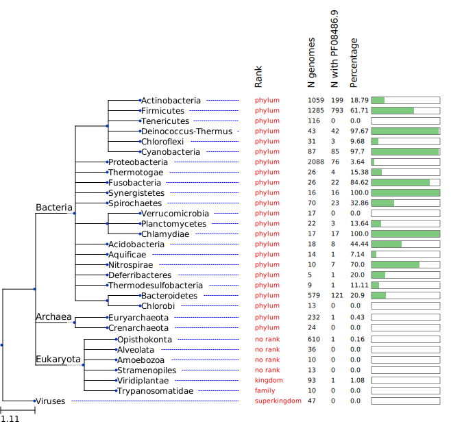

================
Website tutorial
================

.. warning:: 
    This page is under construction. Contact Trestan Pillonel (trestan.pillonel@chuv.ch) if you have any question or suggestion regarding the website or its documentation.

This page attempts to help the user to understand and perform the analyses offered in the webinterface.
If you do not find this page satisfactory enough or you have any suggestions to improve the page, contact Trestan Pillonel (trestan.pillonel@chuv.ch).

--------------------------------
Homology search - Blast
--------------------------------
Perform a blast search of one or more sequences of interest against one more genomes of your database. Either an amino-acid or a nucleotide sequence can be given as input.

(Note that if a constrain is put for the max number of hits it in case of 'all' genomes you may notnotice that uou are missing some data).
Set up:
    * the type of homology search according to your input file:
         -blastp, tblastn with an aa sequence
         -blast_ffn, blast_fna, blastx with a nt sequence
    * e-value
    * maximum number of hits to display
    * target genome or all genomes

Note: If the search is performed agianst all, max number of hits should be set tp 'all' to avoid losing high matching hits. 

In the reported example we blastp the protein sequence of the genes of the fliLMNOPQR operon against all genomes of the database (Fig.1). Through this analysis we can identify if any of these genes is present in the genome and evaluate the number and the identity of alignment of each hits (Fig.2 - Result 1). Additionally, the generated annotated phylogeneny provides a easy visualization to interpret their distribution and conservation along all the genomes (Fig.2 - Result 2). 
| The locus tags are clickable and linked to the protein annotation view page (PUT INTERPAGE LINK TO THAT EXPLANATION)
\

.. figure:: ../img/blastp_search.svg
    :figclass: align-center
    :width: 100%

    **Figure 1:** Blast interface for homology search. Blastp of fliLMNOPQR operon genes (target: all, max number of hits: all). In 'blast input' box amminoacid sequences of all genes introduced by a header.

**Figure 1:** Blast results sep

.. figure:: ../img/blastp_result1.svg
    :figclass: align-center
    :width: 100%

    **Figure 1:** Blast all res 1

    **Figure 1:** Blast all res 2

Additionally the conservation of the homologous sequence along the selected genomes can be observed in the following output.

.. figure:: ../img/blast_phylogeny.png
    :figclass: align-center
    :width: 100%

    **Figure 2:** Phylogenetic distribution and identity of the provided sequence.

HELP: You can retrieve the sequence of a specific gene in the protein annotation view page (LINK) point 2.

--------------------------------
Comparisons
--------------------------------
This block of analyses can be widely modified based on the settings defined dby the user.
Orthogroups are identified by default, and each can be additionally annotated with Swissprot and Refseq databases.
Differently, the user can select to identify KEGG, COG, and PFAM domains along the genomes and perform comparative analyses for each annotation.

Here the outputs related to the Orthogroups analyses are displayed, but their explanation can be extended when consdiering other annotations.

**Overview of Orthogroups analyses**

1.Detailed comparison: you can identiy which orthogroups are in commond between a subset fo genomes of interest and excluded by the others, for example. Some flexibility can be given in selecting those orthogroups that, although present in the selected genomes, are not uniformly present and are missing in some of them ('Missing data' parameter).

1A.Summary of the selected settings for the comparative analysis.

1B.List of identified orthogroups, description and distribution in the selected genomes.

1C.List of locus tag per each orthogroups and genomes of origin.

.. figure:: ../img/OverviewOrt_r1_r2.svg
    :figclass: align-center

    **Figure 3:** Orthogroups comparison overview.

2.:Venn diagram: select a maximum of 6 genomes to visualise the distribution of their Orthologs. Easy representation to visualise similarity or dissimilarity in Orthogroups between a few genomes.
3.:Compare Orthogroup sie: Visualise the number of entries of each Orthogroup in commong between a selected set of genomes. This representation higliths which orthogroups are enriched or poorly represented in the genomes of interest.
4.:Whole proteome heatmaps: Heatmap of presence/absence of the pool of Orthogroups present in the selected genomes. Discover which Orthogroups are widely scared by a subset of interest and which genome differentiate from the others. 

    **Figure 4.**
5.Pan/Core genome plot: Graphical rapresentation of the pan- and core- genome of a subset of genomes or of the uploaded dataset.
This analysis generates three plots that display the content and conservation of Orthologous groups in selected genomes of interest.
A: this plot shows the number of all Orthologous groups present in a set of genomes. If the green curve reaches a plateau we can talk about a closed pangenome since no new Orthogroups are carried by additional genomes, on the contrary the increment of the curve is proportional to the new Orthogroups introduced when looking at other genomes.
B: The red curve represents the core Orthogroups shared by the genomes and it tends to decrease as much as the compared genomes are different.
C: the blue curve represents the number of Orthologous groups present in exactly the n genomes displayed in the x-axis. This representation is useful to appreciate how many Orthologous groups are present in the totality of the genomes of interest, for example, or the diversity brought by single genomes. For example if tot-1 is low it means that there are not specific genomes that bring a unique Orthologous groups, opposite would be the contrary.

.. figure:: ../img/Core_pan_Ort_three.svg
    :figclass: align-center

    **Figure 5.** Accumulation/rarefaction plot. X-axis: number of selected genomes, y-axis (left): pangenome sise, y-axis (right): shared orthologs.

--------------------------------
Genome alignments
--------------------------------

Plot region
=============
Plot the genomic features located in the neighborhood of a provided target locus. This plot let you visualize the conservation of the protein of interest and of the flanking region among selected genomes.
The conservation of a protein, or an operon or thethe components of a certain machinery, here, for example, the needle components of the type three secretion system of Salmonella are reported, can be evaluated and compared. 

.. figure:: ../img/plot_region.png
    :figclass: align-center
    :width: 90%

    **Figure 8.** Plot regions of gene X of type three secretion system of Salmonella y and its flanking regions (8000 bp) along five selected genomes. In green the predicted gene, in black the pseudogenes and in yellow rRNAs and tRNAs.

Circos
=============
Visualize genomes alignment in a circular layout. Following the help box it is possible to recognize which regions encode for genes or tRNA, additionally, the identity percentages helped the identification of conconserved genes.
This visualization favorites the identification of regions which are conserved or absent compared to the reference genome. It is possible to appreciate if any region is conserved or missed among a group of genomes of interest, for example, and looking at the GC content speculate that it is the product of an HGT event. However, please note that regions present in one of the compared genomes but in the reference, will not be visualized. A new plot inverting the genome given as reference will give this info.
When the user clicks on a gene of interest the protein annotation view page will be displayed and provide the user with all the information about function, distribution and conservation of this protein. 
    HIGHLIGTH CONSERVED REGIONS, DIFFERENT GC CONTENT REGIONS

.. figure:: ../img/circos.png
    :figclass: align-center
    :width: 90%

    **Figure 9.** Circos plot of six genomes of interest. 

--------------------------------
Metabolism
--------------------------------
Kegg maps
=============

Put together a sequence of actions you can do in this page and also specify the external links

Kegg modules
=============
Same here - check

--------------------------------
Search for a protein of interest
--------------------------------

The following protein accessions are recognised and can be used in the search bar and also as input to the plot region analysis (CHECK WHICH ONES ARE STILL OK):

=============================   =================
Name 	                        Example
=============================   =================
Genbank locus tag 	            wcw_1594_
Genbank protein accession 	    ADI38940.1_
RefSeq locus tag 	            WCW_RS07680_
RefSeq protein accession 	    WP_013182646.1_
UniParc accession 	            UPI0001D5C1DD_
UniProtKB-Accession 	        D6YS95_
UniProtKB-ID 	                D6YS95_WADCW_
=============================   =================

\

\

It's also possible to seach for a gene or product name:

    * mreb_
    * `mreb Waddlia`_
    * `secretion system`_

\

Please note that the search is performed in coding sequence annotations but also in ``Kegg Orthologs``, ``Interpro`` and ``Kegg 
Pathways/Modules`` description fields. The results (if matches were found) are reported in separate tabs (Figure 1).

\

    **Figure 1:** Search result for ``secretion system``. Note the presence of multiple tabs with search results in 
    coding sequence annotations ("**locus** tab"), but also in **EC**, **Kegg Orthologs** (KO), 
    **Interpro** and **Kegg Pathways**/**Modules** descriptions.

It's also possible to browse genomes tables from links listed in the `zDB home page`_ (column: Browse online)

------------------------
Protein annotation view
------------------------
This page provides a complete overview of a selectd locus (check if only CDS or also RNAs).
A: A summary of the locus tag name, its size, the gene name if annotated and gene product are reported.
B: The Orthologous group in which the locus tag has been reported, the number of homologs, the number of genomes there have been found, and the Orthologous group in which all the homologs have been assigned are displayed.
C: Locus
.. figure:: ../img/locus_page.svg
    :figclass: align-center

    Figure 1: Simplified annotation workflow.

In the boxes with annotation of kegg cogs and pfam you will be redirected to the page of one of these annotations (3 ouputs, all similar, with link to external sources, occurences in proteins in the orthologous groups, then list of locus tags with that annot in all the genomes of the database, phylogeny of the dataset annotated with the copis of hits for that annotation and their distribution in the orthologous groups --- MAYBE PUT AN EXAMPLE OF THAT PAGE FOR ONE ANNOTATION  )
-----------------------------
Orthogroup annotation summary
-----------------------------

A lot of overlapping between the locus tag page and the orthogroups, but one is specific for the locus and the other for the orthogroups, so more general and it could be that some homologs of a locus tag are split in more orthogroups

--------------------------------
Search for a protein of interest
--------------------------------

The following protein accessions are recognised:

=============================   =================
Name 	                        Example
=============================   =================
Genbank locus tag 	            wcw_1594_
Genbank protein accession 	    ADI38940.1_
RefSeq locus tag 	            WCW_RS07680_
RefSeq protein accession 	    WP_013182646.1_
UniParc accession 	            UPI0001D5C1DD_
UniProtKB-Accession 	        D6YS95_
UniProtKB-ID 	                D6YS95_WADCW_
=============================   =================

\

\

It's also possible to seach for a gene or product name:

    * mreb_
    * `mreb Waddlia`_
    * `secretion system`_

\

Please note that the search is performed in coding sequence annotations but also in ``EC``, ``Kegg Orthologs``, ``Interpro`` and ``Kegg 
Pathways/Modules`` description fields. The results (if matches were found) are reported in separate tabs (Figure 1).

\

    **Figure 1:** Search result for ``secretion system``. Note the presence of multiple tabs with search results in 
    coding sequence annotations ("**locus** tab"), but also in **EC**, **Kegg Orthologs** (KO), 
    **Interpro** and **Kegg Pathways**/**Modules** descriptions.

It's also possible to browse genomes tables from links listed in the `zDB home page`_ (column: Browse online)

-----------------
Species phylogeny
-----------------

----------------------
Orthogroup phylogenies
----------------------

“Putative interactors were predicted in-house from genomic data alone using phylogenetic profiling and investigation of conserved gene neighborhood (see online methods). Phylogenetic profile similarity (pattern of presence/absence of orthologs within the PVC superphylum) was calculated using Euclidean and Jaccard distances. Conserved neighbors were identified by identifying orthologs encoded less than 20 kilobases apart in genomes from different species of the PVC superphylum (Figure 1.H). See (19) and (20) for the rationale justifying use of those two approaches.”

---------------------------------------------------
Search using COG, Pfam, Interpro or KEGG accessions
---------------------------------------------------

Accessions from ``KEGG``, ``COG``, ``Pfam`` and ``InterPro`` can also be searched. 
The result page will report a summary of the entry,  the list of proteins annotated 
with this entry as well as a figure showing the presence/absence of this annotation 
in all genomes included in the database (Figure 2).
\

==================  ==========  =========================================================
Accession type 	    Example 	Description
==================  ==========  =========================================================
KEGG ortholog 	    K00844_ 	hexokinase [EC:2.7.1.1]
COG 	            COG0333_ 	Ribosomal protein L32
PFAM 	            PF06723_ 	MreB/Mbl protein
InterPro            IPR004753_  Cell shape determining protein MreB
KEGG modules 	    M00023_ 	Amino acid metabolism
Kegg pathways 	    map00400_ 	Phenylalanine, tyrosine and tryptophan biosynthesis
==================  ==========  =========================================================

\

\

    **Figure 2:** See the `complete profile online`_. 

\

\

.. figure:: ../img/TCA_MAP.svg
    :figclass: align-center
    :width: 90%

------------------------------------------
Taxonomic profile of COGs and Pfam domains
------------------------------------------

----------------
BLAST interface
----------------

A BLAST interface is also available for homology search:

    Figure 1: Simplified annotation workflow.

------------------------
Protein annotation view
------------------------

.. figure:: ../img/locus_page.svg
    :figclass: align-center

    Figure 1: Simplified annotation workflow.

-----------------------------
Orthogroup annotation summary
-----------------------------

---------------------------------------------------------------
Alignments of target genomic regions (from two or more genomes)
---------------------------------------------------------------

.. figure:: ../img/region_align.svg
    :figclass: align-center

    Figure 1: Simplified annotation workflow.

----------------------------------------------------
Whole genomes alignments: interactive circular plots
----------------------------------------------------

.. figure:: ../img/circos_interactive.png
    :figclass: align-center

    Figure 1: Simplified annotation workflow.

--------------------------------------------
comparing the content of two or more genomes
--------------------------------------------

+++++++++
Overview
+++++++++

    Figure 1: Simplified annotation workflow.

+++++++++++++++++++++++++++++++++++++++
Venn diagrams to compare genome content
+++++++++++++++++++++++++++++++++++++++

+++++++++++++++++++++++++++++++++++++++++++++++++++++++++++++++++++++++++
Identification of the largest protein families in one or multiple genomes
+++++++++++++++++++++++++++++++++++++++++++++++++++++++++++++++++++++++++

++++++++++++++++++
Proteomes heatmaps
++++++++++++++++++

++++++++++++++++++++++
Pan/Core genome plots
++++++++++++++++++++++

-------------------------------------------------------------------------
Comparison of COG, Pfam, KO and InterPro annotations at the genome scale
-------------------------------------------------------------------------

 * identification of conserved or clade specific domains/COGs,EC numbers

----------------------------------------------------------------
Get the list of Pfam domains specific to one or a set of genomes
----------------------------------------------------------------

----------
Metabolism
----------
Kegg mapsSelect the genome of interest (Soli),
1)see number if Kegg Orthologs identified for each kegg map
2) click on one map 
3)Two ouputs: for each kegg orth its frequency in this genome and in all the genome sof the dataset --> see if it is abundant or unique or rare etc in your genome of interest
            - second output the phylogenetic tree annotated with all the kegg orthogroups and their frequencies in all genomes (not only one now)

.. _`zDB home page`: https://chlamdb.ch/#genomes
.. _mreb: https://chlamdb.ch/locusx?accession=mreb
.. _`mreb Waddlia`: https://chlamdb.ch/locusx?accession=mreb+Waddlia
.. _`secretion system`: https://chlamdb.ch/locusx?accession=secretion+system
.. _wcw_1594 : https://chlamdb.ch/locusx?accession=wcw_1594
.. _ADI38940.1 : https://chlamdb.ch/locusx?accession=ADI38940.1
.. _WCW_RS07680 : https://chlamdb.ch/locusx?accession=WCW_RS07680
.. _WP_013182646.1 : https://chlamdb.ch/locusx?accession=WP_013182646.1
.. _UPI0001D5C1DD : https://chlamdb.ch/locusx?accession=UPI0001D5C1DD
.. _D6YS95 : https://chlamdb.ch/locusx?accession=D6YS95
.. _D6YS95_WADCW : https://chlamdb.ch/locusx?accession=D6YS95_WADCW
.. _K00844 : https://chlamdb.ch/locusx?accession=K00844
.. _COG0333 : https://chlamdb.ch/locusx?accession=COG0333
.. _PF06723 : https://chlamdb.ch/locusx?accession=PF06723
.. _IPR004753 : https://chlamdb.ch/locusx?accession=IPR004753
.. _M00023 : https://chlamdb.ch/locusx?accession=M00023
.. _map00400 : https://chlamdb.ch/locusx?accession=map00400
.. _`complete profile online` : https://chlamdb.ch/locusx?accession=K01902#tab3

